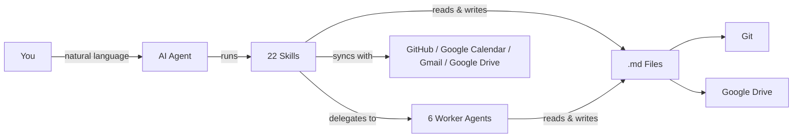
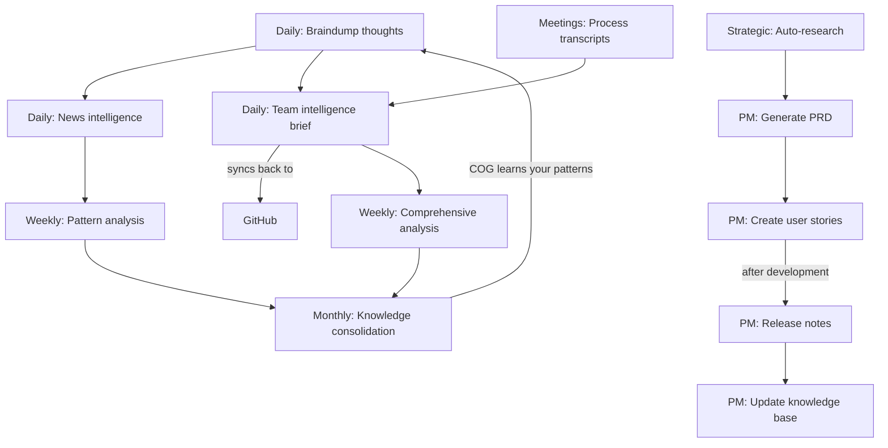

# COG: The Agentic Second Brain That Actually Self-Evolves

**Cognition + Obsidian + Git** — A self-evolving second brain powered by AI agents, markdown files, and version control. No database, no vendor lock-in — just `.md` files that think.

[Quick Start](#quick-start) | [Skills](#skills) | [Features](#features-at-a-glance) | [FAQ](#faq) | [SETUP.md](SETUP.md)

> Works with [Claude Code](https://claude.ai/download) &bull; ~~[Cursor](https://cursor.com/)~~ &bull; ~~[Kiro](https://kiro.dev/)~~ &bull; ~~[Gemini CLI](https://github.com/google-gemini/gemini-cli)~~ &bull; ~~[OpenAI Codex](https://github.com/openai/codex)~~ &bull; any AI that reads markdown
>
> Inspired by [Garry Tan's gstack](https://github.com/garrytan/gstack) and [gbrain](https://github.com/garrytan/gbrain)

> **[Fork Note]:** This is a customized fork for a Hardware Solutions Architect / Special Projects Engineer role. The upstream project is [huytieu/COG-second-brain](https://github.com/huytieu/COG-second-brain). The vault structure, skill set, and integrations have diverged significantly. Changes are annotated throughout this document.



> **[Fork Note]:** Upstream diagram referenced 17 skills and synced with `GitHub / Linear / Slack / PostHog` via iCloud. This fork has 22 skills, uses Google Drive instead of iCloud, and integrates with Google Calendar, Gmail, and Google Drive instead of Linear/Slack/PostHog.

> **New to COG?** ~~Watch the [2-minute walkthrough](https://youtube.com/PLACEHOLDER) to see it in action.~~

## Quick Start

**1. Clone & enter the repo:**
```bash
git clone https://github.com/huytieu/COG-second-brain.git
cd COG-second-brain
```

**2. Run onboarding in your agent:**

| Agent | Command | How it finds skills |
|---|---|---|
| Claude Code | `code .` → "Run onboarding" | `.claude/skills/` |
| ~~Cursor~~ | ~~Open folder → "Run onboarding"~~ | ~~`.cursor-plugin/` + `.cursorrules`~~ |
| ~~Kiro~~ | ~~Open folder → "setup COG"~~ | ~~`.kiro/powers/`~~ |
| ~~Gemini CLI~~ | ~~`gemini` → `/onboarding`~~ | ~~`GEMINI.md` + `.gemini/commands/`~~ |
| ~~OpenAI Codex~~ | ~~`codex` → "Run onboarding"~~ | ~~`AGENTS.md`~~ |
| Other agents | Point at `AGENTS.md` → "Run onboarding" | `AGENTS.md` |

> **[Fork Note]:** `.cursor-plugin/`, `.kiro/`, `.gemini/`, and `GEMINI.md` have been removed from this fork. Only Claude Code and the `AGENTS.md` fallback are supported.

~~**Or install via [skills.sh](https://skills.sh):**~~
```bash
# Upstream only — this fork is not published to skills.sh
# npx skills add huytieu/COG-second-brain
```

Done — COG is personalized and ready in ~2 minutes. See [SETUP.md](SETUP.md) for optional config (~~Git sync, iCloud,~~ Google Drive, Obsidian Tasks, etc.).

## Agent Support Matrix

COG ships a **full Claude Code surface** ~~plus **core native surfaces** for Kiro and Gemini CLI, with `AGENTS.md` as the universal fallback for Codex and other markdown-reading agents~~.

> **[Fork Note]:** This fork is Claude Code–only. All non-Claude-Code platform surfaces have been removed.

| Surface | Current support | Notes |
|---|---|---|
| Claude Code | 22 native skills + 6 worker agents | Full first-class surface |
| ~~Cursor~~ | ~~Plugin manifest + rules~~ | ~~`.cursor-plugin/plugin.json` + `.cursorrules`~~ — **removed** |
| ~~Kiro~~ | ~~7 native powers~~ | ~~Core workflows today~~ — **removed** |
| ~~Gemini CLI~~ | ~~7 native commands~~ | ~~Core workflows today~~ — **removed** |
| `AGENTS.md` | 22 documented commands | Universal fallback |

~~Before publishing or updating framework files, run `./scripts/validate-agent-surface.sh` to catch drift between manifests, docs, and shipped files.~~ See [docs/AGENT-SUPPORT.md](docs/AGENT-SUPPORT.md) for the detailed support matrix and contributor rules.

> **[Fork Note]:** `validate-agent-surface.sh` still exists but the multi-surface manifests it validates are no longer maintained.

## Skills

### Core Skills (Personal Knowledge)

| Skill | What it does | Try saying... |
|---|---|---|
| **onboarding** | Personalize COG for your workflow (run first!) | "Run onboarding" |
| **braindump** | Capture raw thoughts with intelligent classification | "I need to braindump" |
| **daily-brief** | Verified news intelligence (7-day freshness) | "Give me my daily brief" |
| **url-dump** | Save URLs with auto-extracted insights | "Save this URL" |
| **weekly-checkin** | Cross-domain pattern analysis | "Weekly review" |
| **knowledge-consolidation** | Build frameworks from scattered notes | "Consolidate my knowledge" |
| **update-cog** | Update framework files without touching your content | "Update COG" |

### Team Intelligence Skills (for Product & Engineering Leads)

| Skill | What it does | Try saying... |
|---|---|---|
| **team-brief** | Cross-reference GitHub ~~+ Linear + Slack + PostHog~~ into a daily team intelligence brief ~~with two-way Linear sync-back~~ | "Team brief" / "What did we ship?" |
| **meeting-transcript** | Process meeting recordings into structured decisions, action items, and team dynamics | "Process this meeting" |
| **comprehensive-analysis** | Deep 7-day analysis for weekly reviews, board prep, or strategic planning (~8-12 min) | "Weekly analysis" / "Board prep" |

### PM Workflow Skills (for Product Managers)

> **[Fork Note]:** Four of the six PM workflow skills have been removed from this fork. Remaining skills are `generate-prd` and `update-knowledge-base`.

| Skill | What it does | Try saying... | Status |
|---|---|---|---|
| ~~**create-user-story**~~ | ~~Create user stories with duplicate checking across Linear, GitHub Issues, or Jira~~ | ~~"Create a user story for..."~~ | **removed** |
| **generate-prd** | Draft PRDs with approval gate before publishing to Confluence/Notion | "Generate a PRD for..." | active |
| ~~**generate-release-notes**~~ | ~~Generate release notes from GitHub milestones, Linear cycles, or manual input~~ | ~~"Generate release notes for v2.1"~~ | **removed** |
| ~~**export-open-issues**~~ | ~~Audit and export open issues from any tracker into a structured vault summary~~ | ~~"Export open issues"~~ | **removed** |
| ~~**publish-to-confluence**~~ | ~~Publish any vault markdown file to Confluence~~ | ~~"Publish this to Confluence"~~ | **removed** |
| **update-knowledge-base** | Maintain product knowledge base from releases, features, and project changes | "Update the knowledge base with v2.1 changes" | active |

> **PM Workflow:** ~~These skills form a complete product management lifecycle: **Research** (`/auto-research`) → **PRD** (`/generate-prd`) → **Stories** (`/create-user-story`) → Development → **Release Notes** (`/generate-release-notes`) → **Knowledge Base** (`/update-knowledge-base`). Use `/export-open-issues` for audits and `/publish-to-confluence` to share externally.~~ The remaining PM skills are `/generate-prd` and `/update-knowledge-base`.

### Strategic Research

| Skill | What it does | Try saying... |
|---|---|---|
| **auto-research** | Deep strategic research engine — decomposes questions into parallel research threads with multiple agents | "Research the future of AI testing tools" |
| **scout** | Evaluate URLs and tools — check vault coverage, assess relevance, recommend save or skip | "Scout this URL" |
| **eval** | Structured technology evaluation using TRL scoring (1-9) and 8 evaluation dimensions | "Evaluate this technology" |

### Fork-Added Skills

> **[Fork Note]:** The following skills do not exist in the upstream project. They were added to this fork to support a Hardware Solutions Architect workflow.

| Skill | What it does | Try saying... |
|---|---|---|
| **daily-plan** | Generate today's operational plan — calendar events, CRM lookups, open loops, 3 prioritized actions | "Daily plan" |
| **prep** | Pre-meeting briefing doc — attendee profiles, open items, agenda, talking points | "Prep for my meeting" |
| **decide** | Log a decision with rationale, alternatives rejected, and confidence level | "Log this decision" |
| **mistake** | Log an error with root cause analysis and prevention rule | "Log this mistake" |
| **compress** | Prune stale context, summarize aging docs, clean resolved open loops | "Compress context" |
| **ingest** | Ingest documents into the knowledge graph via entity extraction | "Ingest this document" |
| **playbook** | Generate a first-30-days onboarding playbook from knowledge gaps and people CRM | "Generate playbook" |

### Worker Agents (Specialist Sessions)

COG uses a worker agent architecture inspired by [garrytan/gstack](https://github.com/garrytan/gstack) specialist sessions and [garrytan/gbrain](https://github.com/garrytan/gbrain) knowledge patterns. Workers handle data-heavy tasks cheaply (Sonnet) while the lead session does reasoning (Opus).

| Agent | What it does | Model |
|---|---|---|
| **worker-data-collector** | Structured extraction from GitHub, ~~Slack, Jira, Linear~~ | Sonnet |
| **worker-researcher** | Web research with source citations | Sonnet |
| **worker-file-ops** | Vault file operations, metadata, profiles | Sonnet |
| **worker-executor** | Pre-approved mutations (~~Jira, Linear,~~ APIs) | Sonnet |
| **worker-publisher** | Publishing to ~~Slack, Confluence,~~ Notion | Sonnet |
| **brief-people-updater** | Batch-update people profiles from meetings/briefs | Sonnet |

> Workers write results to `/tmp/` files and return only a status + path. The lead reads the file for synthesis. This eliminates slow token generation in agent output.

### People CRM (Knowledge-Based Team Profiles)

Track the people you work with using progressive, evidence-based profiles in ~~`05-knowledge/people/`~~ **`02-people/`**. Profiles auto-escalate via tiered enrichment:

> **[Fork Note]:** People CRM was moved from `05-knowledge/people/` to a top-level `02-people/` directory in this fork.

- **Tier 3 (Stub)** — 1 mention: name, role, one-line context
- **Tier 2 (Moderate)** — 3+ mentions: executive snapshot, working style, strengths
- **Tier 1 (Full)** — 8+ mentions or direct meeting: complete profile with all sections

Every observation includes a source citation with confidence level. See `02-people/README.md` for details.

### Role Packs (Personalized Recommendations)

COG matches your role during onboarding to a **role pack** that prioritizes the most relevant skills and integrations for you. ~~Available role packs: Product Manager, Engineering Lead, Engineer, Designer, Founder, Marketer — or create your own from the template.~~

> **[Fork Note]:** The upstream ships 7 role packs. This fork retains only `engineer` and adds `hardware-solutions-architect`. Removed: ~~Product Manager~~, ~~Engineering Lead~~, ~~Designer~~, ~~Founder~~, ~~Marketer~~. A `_template.md` is still available for creating custom packs.

> **New to team skills?** These require GitHub CLI (`gh`) and work best with ~~Linear, Slack, and PostHog~~ MCP integrations. They degrade gracefully — start with just GitHub and add integrations over time. See [SETUP.md](SETUP.md) for configuration.

## The Evolution Cycle



> **[Fork Note]:** Upstream diagram synced back to `Linear / GitHub`. This fork syncs to GitHub only. The PM lifecycle steps for user stories and release notes remain in the diagram but those skills have been removed from this fork.

- **Daily capture** — braindump raw thoughts; COG classifies by domain and extracts action items
- **Daily intelligence** — personalized news briefings with verified, sourced news
- **Daily team brief** — cross-reference GitHub, ~~Linear, Slack, PostHog,~~ meetings into one brief ~~with two-way sync~~
- **Meeting processing** — extract decisions, action items, and team dynamics from transcripts
- **Weekly reflection** — pattern analysis across all domains surfaces insights you'd miss
- **Weekly deep dive** — comprehensive analysis for board prep, retros, and strategic planning
- **Monthly synthesis** — scattered notes become consolidated frameworks and a knowledge base
- **Strategic research** — deep multi-agent investigation of strategic questions with real sources
- **PM workflow** — ~~full product lifecycle from PRD to release notes to knowledge base updates~~ PRD drafting and knowledge base maintenance

## Features at a Glance

| | | |
|---|---|---|
| **Self-Evolving** — Learns your patterns, auto-organizes content, builds frameworks | **Self-Healing** — Rename files or restructure; cross-references update automatically | **Verification-First** — Sources required, 7-day freshness, confidence levels on all analysis |
| **Privacy-First** — Local `.md` files, strict domain separation, no external servers | ~~**Multi-Device** — iCloud sync to iPhone/iPad/Mac; Git for version history~~ **Multi-Device** — Google Drive sync; Git for version history | **Obsidian Tasks** — `📅 YYYY-MM-DD` emoji format works with Tasks plugin dashboards |
| **Garry Tan Inspired** — gstack specialist sessions + gbrain knowledge patterns | ~~**Multi-Platform** — Listed on [skills.sh](https://skills.sh), [agentskill.sh](https://agentskill.sh), [cursor.directory](https://cursor.directory)~~ **Claude Code–Only** — Optimized single-platform surface | **Worker Agents** — Sonnet handles I/O, Opus handles thinking |

## Your Vault

> **[Fork Note]:** The vault directory structure has been significantly reorganized from the upstream. The upstream structure is shown struck-through; the actual structure used in this fork follows.

**Upstream structure (original):**
```
COG-second-brain/
├── .claude/skills/          # Claude Code skills (17)
├── .claude/agents/          # Worker agent definitions (6)
├── ~~.claude/roles/~~           # ~~Role packs (7) — personalized recommendations~~
├── ~~.kiro/powers/~~            # ~~Kiro powers~~
├── ~~.gemini/commands/~~        # ~~Gemini CLI commands~~
├── AGENTS.md                # Universal agent docs
├── CLAUDE.md                # Framework instructions
├── 00-inbox/                # Profiles, interests, integrations
├── 01-daily/                # Briefs & check-ins
├── ~~02-personal/~~             # ~~Personal braindumps (private)~~
├── ~~03-professional/~~         # ~~Professional braindumps & strategy~~
├── ~~04-projects/~~             # ~~Per-project tracking~~
├── ~~05-knowledge/~~            # ~~Consolidated insights & patterns~~
│   └── ~~people/~~              # ~~People CRM profiles~~
└── ~~06-templates/~~            # ~~Document templates~~
```

**This fork's actual structure:**
```
COG-second-brain/
├── .claude/skills/          # Claude Code skills (22 — 17 upstream + 9 added - 4 removed)
├── .claude/agents/          # Worker agent definitions (6)
├── .claude/roles/           # Role packs (3: hardware-solutions-architect, engineer, _template)
├── .claude/hooks/           # Claude Code hooks
├── AGENTS.md                # Universal agent docs
├── CLAUDE.md                # Framework instructions
├── SOUL.md                  # Agent personality and values
├── USER.md                  # User profile, accounts, domain depths
├── MEMORY.md                # Cross-session key learnings
├── OPEN_LOOPS.md            # Unresolved items
├── 00-inbox/                # Profiles, interests, integrations
├── 01-daily/                # Briefs & check-ins
│   ├── briefs/              # Morning brief outputs
│   └── checkins/            # End-of-day logs
├── 02-people/               # People CRM profiles (moved from 05-knowledge/people/)
├── 03-projects/             # Active and archived projects
├── 04-knowledge/            # Domain knowledge, tech evals, research
│   ├── regulations/         # HIPAA, FCC, state privacy laws
│   ├── technologies/        # IoT protocols, sensing tech, edge computing
│   ├── competitors/         # Senior living tech competitive landscape
│   ├── consolidated/        # Synthesized frameworks
│   ├── patterns/            # Identified patterns
│   └── booklets/            # URL bookmarks by category
├── 05-decisions/            # All decisions with rationale (append-only)
├── 06-mistakes/             # Error log with prevention rules
├── 07-resources/            # Tools, scripts, reference docs
├── AI/                      # Agent output folder
│   ├── sessions/            # Per-session summaries
│   ├── research/            # Research agent outputs
│   ├── evaluations/         # Tech eval outputs
│   └── drafts/              # Document drafts
├── graph/                   # Knowledge graph (graph.json, ingest_manifest.json)
├── scripts/                 # Utility scripts (ingest.py, query.py, drive_sync.py, etc.)
└── templates/               # Note templates
```

> **Real-world results:** 120+ braindumps processed, daily briefs with 95%+ source accuracy, 5 major strategic insights discovered — zero maintenance required.

## Keeping COG Updated

COG separates **framework files** (skills, docs, scripts) from **your content** (braindumps, profiles, notes). Updates never touch your personal data.

| Method | Command |
|---|---|
| AI Agent (any) | "Update COG" or `/update-cog` |
| Shell script | `./cog-update.sh` (interactive) &bull; `--check` &bull; `--dry-run` &bull; `--force` |
| Manual Git | `git fetch cog-upstream main` then checkout specific files |

Check your version: `cat COG-VERSION`  
Validate packaged surfaces: `./scripts/validate-agent-surface.sh`

## FAQ

<details><summary><strong>Why not just use Notion / Roam / Obsidian alone?</strong></summary>

COG adds self-evolving intelligence on top. It doesn't just store — it learns, analyzes, and synthesizes insights automatically.
</details>

<details><summary><strong>How much does it cost?</strong></summary>

COG is free and open-source (MIT). You only pay for your AI agent's API usage.
</details>

<details><summary><strong>Is my data private?</strong></summary>

Yes. Everything is local markdown files. The AI agent's API is only called when you invoke a skill. No data stored on external servers.
</details>

<details><summary><strong>Can I customize or add skills?</strong></summary>

Yes — edit any `SKILL.md` / ~~`POWER.md`~~ / `AGENTS.md` file. See [SETUP.md](SETUP.md) for details on creating new skills.
</details>

<details><summary><strong>Will updating overwrite my customizations?</strong></summary>

No. The update process detects customized files and lets you choose per-file: keep yours, use upstream, or backup + update. Nothing is overwritten without approval.
</details>

<details><summary><strong>What if I don't use Git?</strong></summary>

Git is optional but recommended for version history. COG works fine with ~~just iCloud sync~~ Google Drive sync.
</details>

## Roadmap

- [x] ~~Gemini CLI + OpenAI Codex support~~ (shipped in v3.1) — **removed in this fork**
- [x] ~~Upstream update system~~ (shipped in v3.2)
- [x] ~~Role packs & integration discovery~~ (shipped in v3.3) — **reduced to 3 role packs in this fork**
- [x] ~~PM workflow skills & auto-research~~ (shipped in v3.4) — **4 of 6 PM skills removed in this fork**
- [x] ~~Worker agents, people CRM & specialist sessions~~ (shipped in v3.5)
- [x] ~~Integration with calendar/task management tools~~ — **active in this fork: Google Calendar + Gmail**
- [ ] Web interface for knowledge graph visualization
- [ ] Mobile-first commands (optimized for Obsidian mobile)
- [ ] Team collaboration features (with privacy preservation)

## Contributing & Support

| | | |
|---|---|---|
| [Contribute](CONTRIBUTING.md) | [Report bugs](https://github.com/huytieu/COG-second-brain/issues) | [Discussions](https://github.com/huytieu/COG-second-brain/discussions) |
| [Sponsor on GitHub](https://github.com/sponsors/huytieu) | [Buy me a coffee](https://buymeacoffee.com/0xlight) | [MIT License](LICENSE) |

## Acknowledgments & Inspiration

Built with [Claude Code](https://claude.ai/code), ~~[Cursor](https://cursor.com/), [Kiro](https://kiro.dev/), [Gemini CLI](https://github.com/google-gemini/gemini-cli), [OpenAI Codex](https://github.com/openai/codex),~~ and [Obsidian](https://obsidian.md/).

**Key inspirations:**
- [**Garry Tan's gstack**](https://github.com/garrytan/gstack) — specialist sessions, clear operating gears, repo-local skill distribution. COG's worker agent architecture and model routing borrow directly from gstack's explicit mode separation.
- [**Garry Tan's gbrain**](https://github.com/garrytan/gbrain) — Compiled Truth + Timeline pattern, tiered enrichment for people profiles, brain-first lookup protocol. COG's people CRM and knowledge-first approach are adapted from gbrain's design.
- **Zettelkasten** — atomic, interlinked notes as the foundation of knowledge
- **Building a Second Brain (Tiago Forte)** — PARA organization, progressive summarization
- **GTD (David Allen)** — capture everything, process systematically

## Star History

[](https://www.star-history.com/#huytieu/COG-second-brain&type=date&legend=top-left)

---

**TL;DR:** Clone, run onboarding, braindump daily. COG evolves with you — just `.md` files, any AI agent, zero maintenance.
